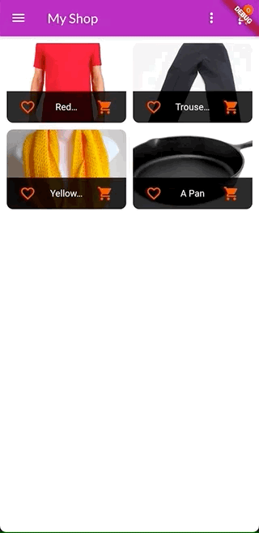
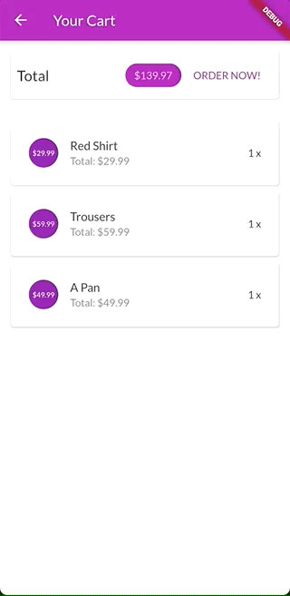
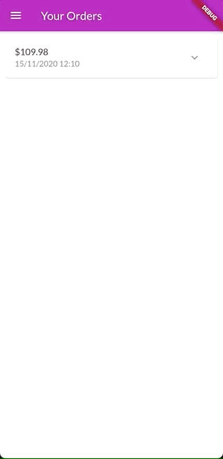
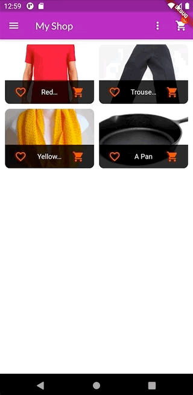
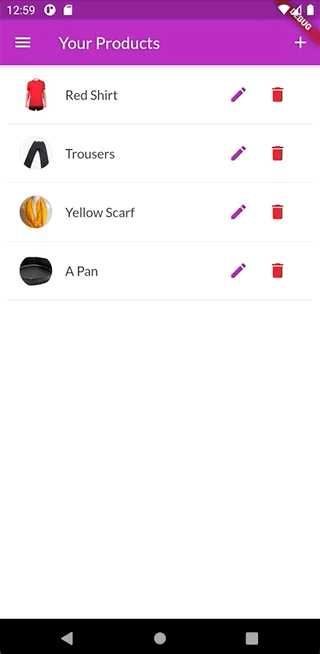

# My Shop (Flutter)

See a complete app that replicate how a shop works, be familiar with how state management works.

## Demo

| Filter your favorites              | See a basic product details        |
| ---------------------------------- | ---------------------------------- |
|  |  |

| Add products to your cart          | Remove products from cart or order them |
| ---------------------------------- | --------------------------------------- |
|  |       |

| Navigate between store or orders   | Expand your order to see a list of what includes |
| ---------------------------------- | ------------------------------------------------ |
|  |                |

---

| Be able to manage your products    | Add new products to your cart      |
| ---------------------------------- | ---------------------------------- |
|  |  |

| Edit your current products         | Remove the products                |
| ---------------------------------- | ---------------------------------- |
|  |  |